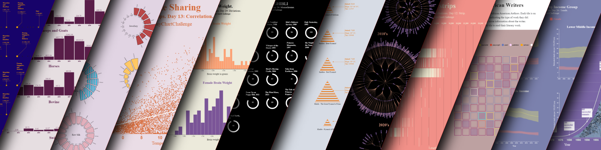

 

# 30 Day Chart Challenge, 2021.

Charts were originally published using Observable. You can find the collection here [*Urmila J - 30daychartchallenge.*](https://observablehq.com/collection/@urmilaj/30daychartchallenge)

The purpose of this repository is for recreating the charts in vanilla format.

# Week 1 topic: Comparisons.
- Day 1: Part to Whole. [Phylogeny](phylogeny.html)
- Day 2: Pictogram. [Rice Varieties](rice.html)
- Day 3: Historical. [On This Day](onthisday.html)
- Day 4: Magical. [Solar Maxima and Human Excitability](solar.html)
- Day 5: Slope. [Pyramids of Egypt](pyramids.html)
- Day 6: Experimental [Indian Space Research Organisation's Experimental Satellites](satellites.html)

# Week 2 topic: Distributions.
- Day 7: Physical [Raja Ravi Varma's paintings](varma.html)
- Day 8: Animals [India's live animal exports](exports.html)
- Day 9: Statistics [A bee-swarm plot of colours used in Bob Ross paintings](paintings.html)
- Day 10: Abstract [Statistical Abstract Relating to British India](administration.html)
- Day 11: Circular [Value of Merchandise and Treasure exported from British India](circularBarplot.html)
- Day 12: Strips [Airstrips](airstrips.html)

# Week 3 topic: Relationships. 
- Day 13: Correlation [Seoul Bike Sharing](bikeShare.html)
- Day 14: Space [Space Tech Companies and Venture Capitals](spaceTech.html)
- Day 15: Multivariate [Fertility](fertility.html)
- Day 16: Trees [Sacred Groves of India](grove.html)
- Day 17: Pop Culture [Kpop](kpop.html)
- Day 18: Connections [Quentin Tarantino movies and profanity](profanity.html)

# Week 4 topic: Timeseries.
- Day 19: Global Change [World Forest Area](forest.html)
- Day 20: Upwards [Mount Everest Summits](everest.html)
- Day 21: Downwards [World Crude Birth Rate](birth.html)
- Day 22: Animation [Earthquakes (1900-2014)](quake.html)
- Day 23: Tiles [African American Writers](writers.html)
